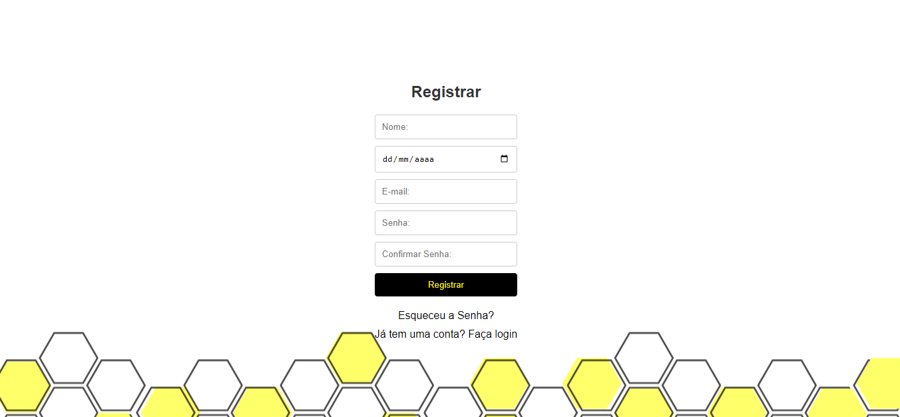
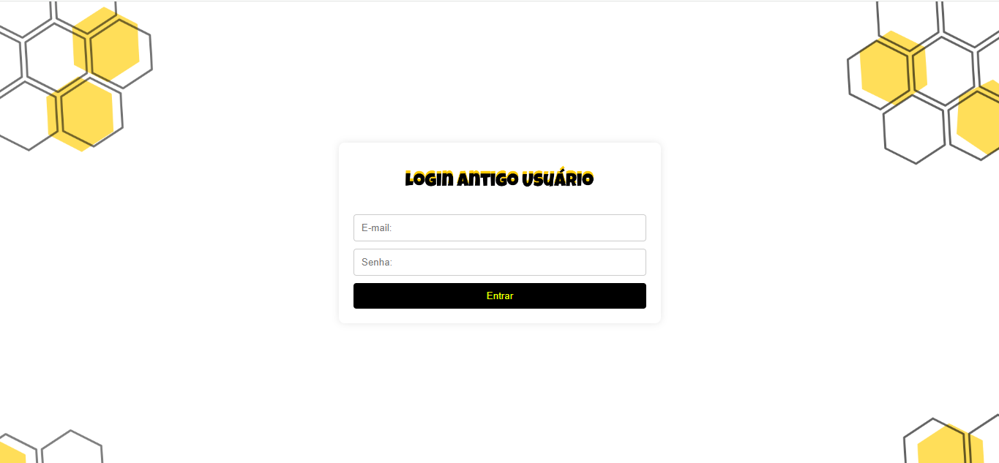

# 🚀 Sejam todos bem-vindos ao meu repositório de login e cadastro do projeto xô bagunça

## Índice
- [Conexão de Banco de Dados](#conex%C3%A3o-de-banco-de-dados)
- [Descrição](#descri%C3%A7%C3%A3o)
- [Introdução](#introdu%C3%A7%C3%A3o)
- [Funcionalidades](#funcionalidades)
- [Tecnologias Utilizadas](#tecnologias-utilizadas)
- [Fontes Consultadas](#fontes-consultadas)
- [Autores](#autores)

# 💾 telas do site 

`CADASTRO`  

`LOGIN`  

## ✅ Descrição
esse codigo foi desenvolvido para fazer a parte de cadastrar o projeto do xô bagunça
## 📃 Introdução
nesse repositorio você vera o codigo e as interações que eles tem com a tela

## 🔧 Funcionalidades
- fazer login
- fazer cadastro.
- digitar os dados na tela de cadastro e armazenar no banco de dados para quando usuario voltar só fazer o login.

## 📁 Estrutura do Projeto
- `conexao.php`: Arquivo de configuração da conexão com o banco de dados.
- `salvarCAD.php`: salvar cadastro do ususario.
- `check_email.php`: verifica se o email ja eixste para impedir email duplicado no banco de dados.
- `verifica_email.php`: verifica se email e senha está corrto para o usuario entrar no site novamente.
  
## 📌 Tecnologias Utilizadas
- HTML5    
- CSS3   
- PHP 8.1   

## ✒️ Autores
[Leonardo De Oliveira](https://github.com/leoOliveiraBR)  
